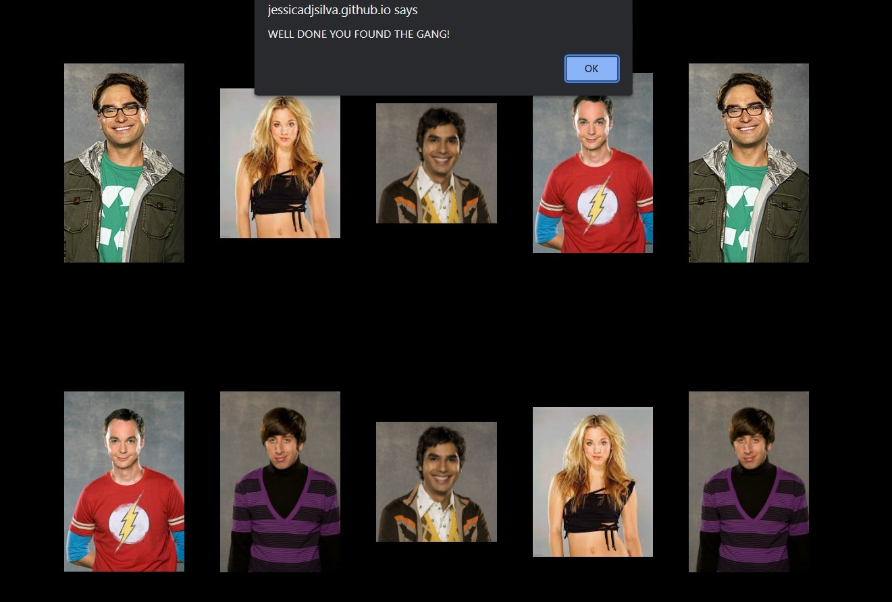
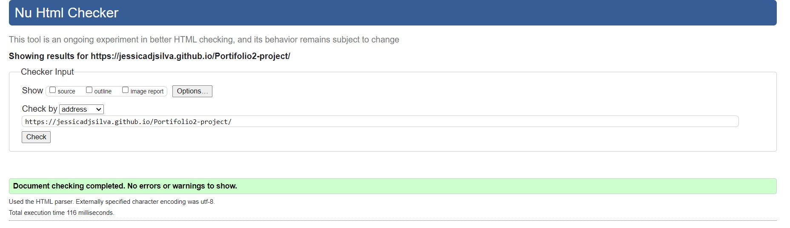
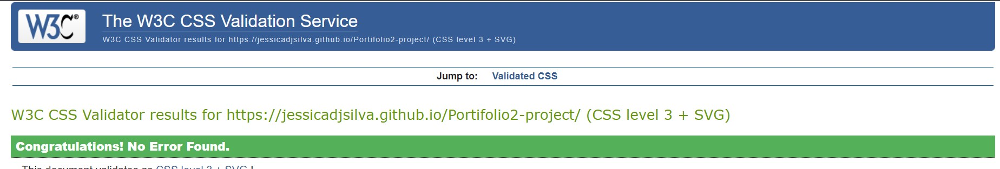
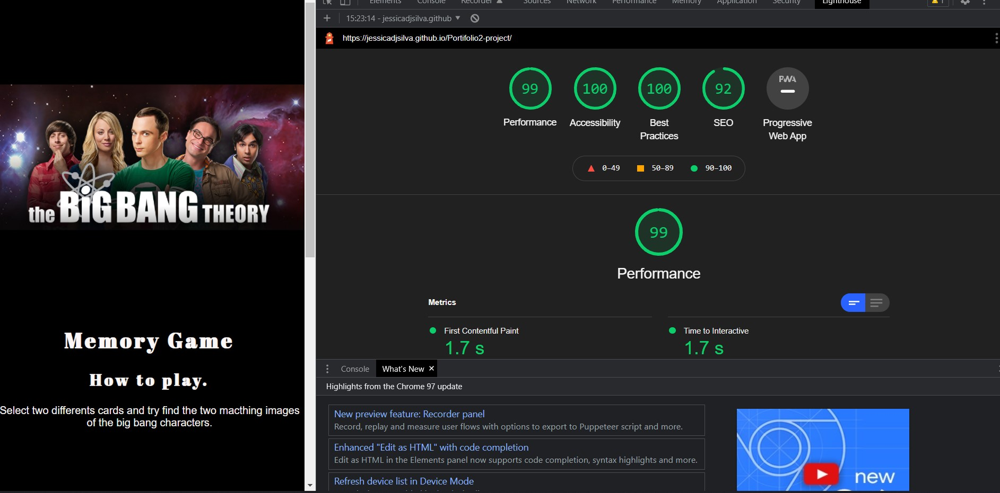
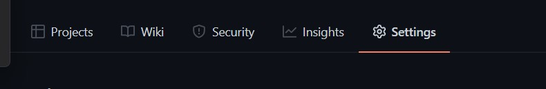
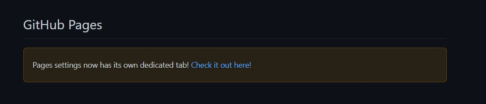
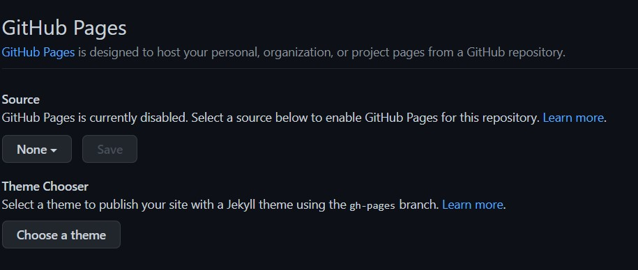
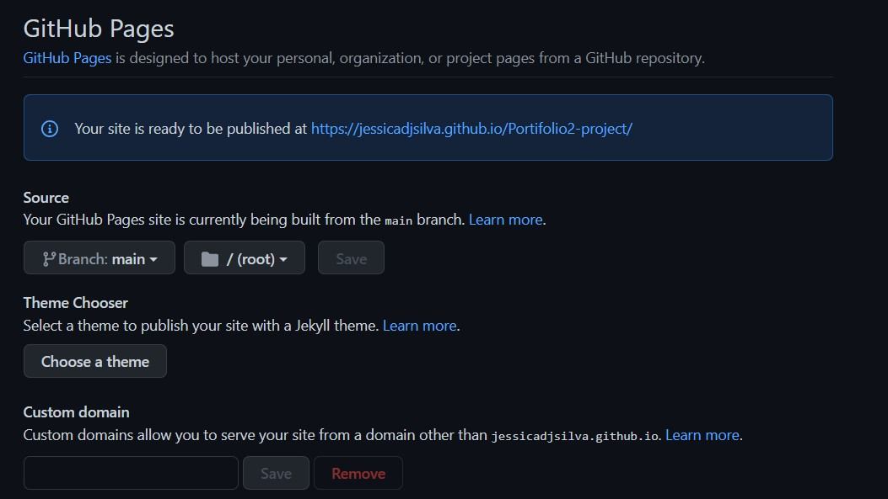
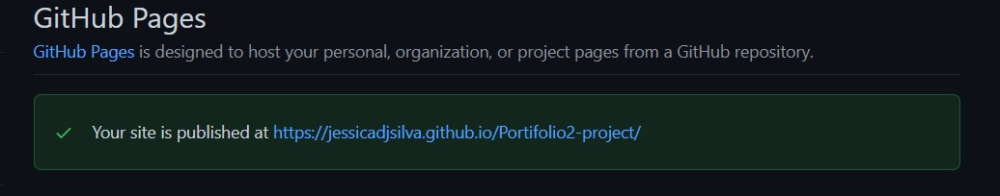

## The Big Bang Theory Memory game 
The memory game is a classic game made up of pieces that have a figure on one side. It was first mentioned in China in the 15th century and consisted of illustrated and duplicated cards. Each figure is repeated in two different cards.

To start the game, the pieces are placed with the figures facing down, so that they cannot be seen.

In the classic game, each participant must, in turn, turn over two pieces and let everyone see them. If the figures are the same, the participant must collect this pair and play again. If they are different pieces, they must be turned over again, and the turn is passed to the next participant.

In The Big Bang Theory Game, the player needs to find the 5 characters of the American tv series, the 10 cards are sorted randomly and when one match is found both images stay static on the user screen.

## Features

### Header
There is an image on the top of the page with the 5 characters that the user needs to find in the game.
The image contrast with the background for better accessibility. 

#### How to play
Before starting the game, the user has clear instructions on how the game works and what is needed to do to achieve the aim.

### Game Results
when the player find all the matching cards the brower will trow a mensage "well done you found the gang"

## Testing
 - The website works in the 3 main browsers: Chrome, Edge, Firefox.
 - The website looks correct in all common dimensions using the dev tools tool to change the size of the website each time.
 - All text is readable and accessible with all images having alt text and all text being contrasted against the background.

## Bugs
- The page images were giving 404 errors because the path was related to the JavaScript file, not HTML.
- The link that I used for the images didn't work originally due to a space in the name, this was fixed by renaming the images and the references.
- The images were showing in the same place every time was necessary a shuffle function to make it randomly 

## Validator Testing 
- No HTML issues were found after using the W3C validator and resolving any issues.

-- No CSS issues were found after using Jigsaw validator and resolving any issues.

- Accessibility checked on lighthouse.

- 
## Deployment
To deploy my game on GitHub I follow the steps.
Click on setting.

scroll down to GitHub pages and click on the link.

Inside GitHub page change source from none to Main.

The message will show that the website is will be published soon.

After a few seconds, the website will be published, check the live link [here](https://jessicadjsilva.github.io/Portifolio2-project/)

## Unfixed bugs
No unfixed bugs to report.

## Credit

- Google fonts for the website fonts.
- Google images for all the images.

